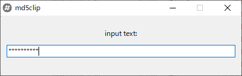
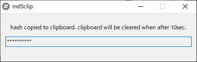

# md5clip

  put base64 encoded md5 digest to clipboard. 
  clipboard will cleared when after 10sec. 

  code is same as: 
  will be the same as the result of the command on linux: 
  read -s ; echo -n $REPLY | md5sum | awk '{printf $1}' | base64 

### build

  pyinstaller -w --icon=md5clip.ico md5clip.pyw

### install and usage:

  clone or download zip from this repo. (and decompress zip) 
  execute ./dist/md5clip/md5clip.exe 
  or command on console "python md5clip.pyw" 

### screenshot:

  
  
  
  

### icon's license:

  Creative Commons Attribution-Share Alike 4.0 International License 
  https://commons.wikimedia.org/wiki/File:Eo_circle_grey_hash.svg 

